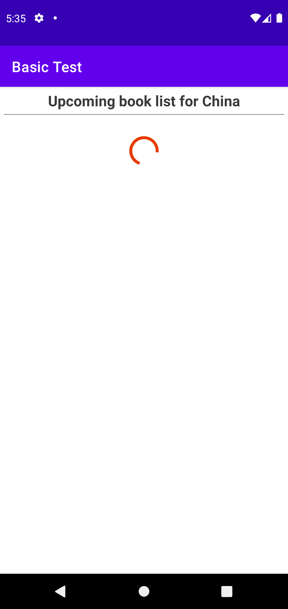
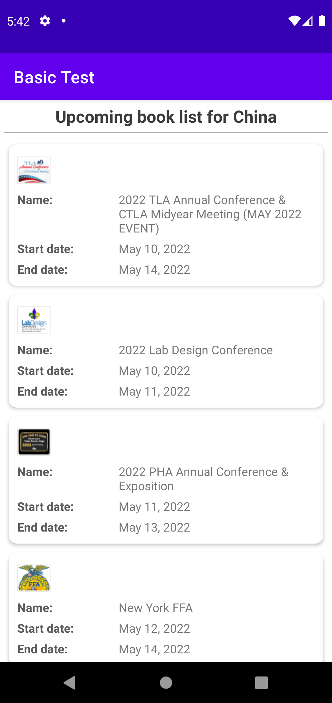
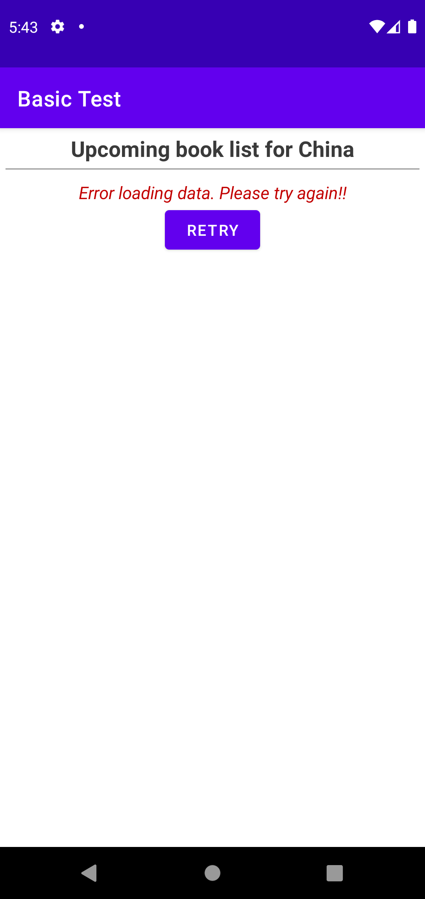

# Basic Android Example
## Select build variant america/chinese to switch the app environment

## You can see a progress bar while data is being loaded

## You can see the list of data when app succeeded loading data

## You can see error message and retry button when app failed loading data
